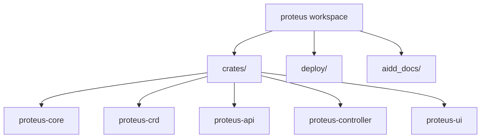

# Codebase Map

## Areas

- `crates/`: all Rust packages (workspace members)
- `deploy/`: Dockerfile, Kustomize, CRDs, examples
- `aidd_docs/`: AIDD project memory

## Entry points

- `crates/proteus-controller/src/main.rs` — operator + embedded API/UI
- `crates/proteus-ui/src/main.rs` — Dioxus WASM UI
- `deploy/overlays/default` — cluster install (Kustomize)

## Packages

- `proteus-core`: CAS
- `proteus-crd`: CRD types
- `proteus-api`: Axum + embedded assets
- `proteus-controller`: reconcile + process entrypoint
- `proteus-ui`: Dioxus operator UI
