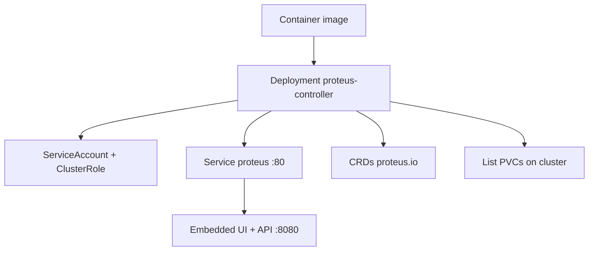

# Deployment

How Proteus is built and shipped to a Kubernetes cluster.

## Tooling

- Container image: multi-stage `deploy/Dockerfile` (Dioxus WASM UI → Rust release → distroless runtime)
- Cluster install: Kustomize under `deploy/` (`base` + `overlays/default`) — **no Helm**
- CRDs live in `deploy/crds/` and are applied with the base
- Image registry: `ghcr.io/craftingtech/proteus-controller` (CI multi-arch `amd64`/`arm64`)

## Topology

## Conventions

- Image name default: `ghcr.io/craftingtech/proteus-controller:<tag>`
- Install: `kubectl apply -k deploy/overlays/default`
- Override image tag in the overlay `images:` field
- Local repo data path in-cluster: `/var/lib/proteus` (emptyDir in base; replace with PVC for persistence)
- GitOps: consumers may Argo-source this repo (`path: deploy/overlays/default`) or vendor `deploy/` into their own GitOps repo; Ingress is a consumer overlay
