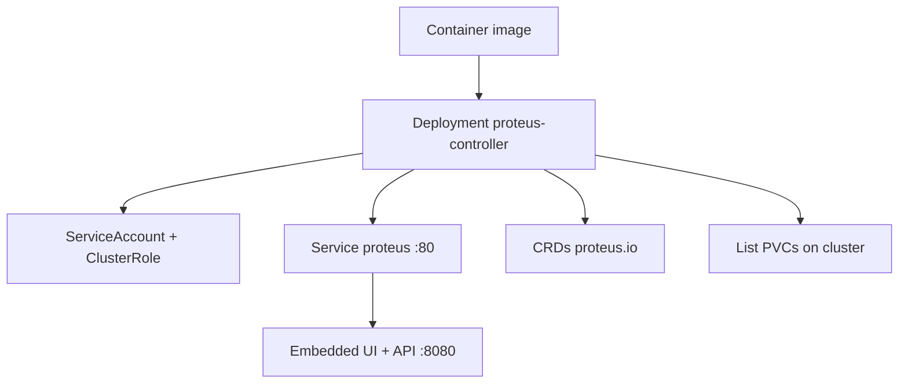

# Deployment

How Proteus is built and shipped to a Kubernetes cluster.

## Tooling

- Container image: multi-stage `deploy/Dockerfile` (Dioxus WASM UI → Rust release → distroless runtime)
- Cluster install: Kustomize under `deploy/kustomize/` (`base` + `overlays/default`)
- CRDs live in `deploy/kustomize/crds/` and are applied with the base

## Topology

## Conventions

- Image name default: `ghcr.io/craftingtech/proteus-controller:<tag>`
- Install: `kubectl apply -k deploy/kustomize/overlays/default`
- Override image tag in the overlay `images:` field
- Local repo data path in-cluster: `/var/lib/proteus` (emptyDir in base; replace with PVC for persistence)
