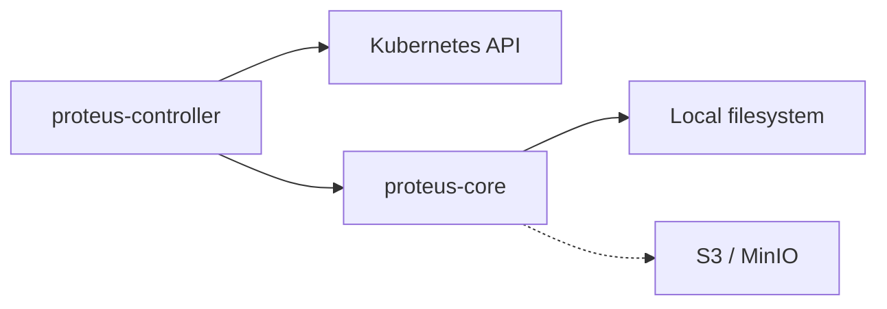

# Integration

How this system integrates with external/third-party services.

## External services

- Kubernetes API server — source of truth for CRDs and reconcile (`kube::Client`)
- Local filesystem — CAS objects via `proteus_core::LocalBackend` under a configured path
- S3-compatible object storage — configured on `ProteusRepository` / `S3BackendSpec`, CAS put/get via `proteus_core::S3Backend` (`object_store`)

