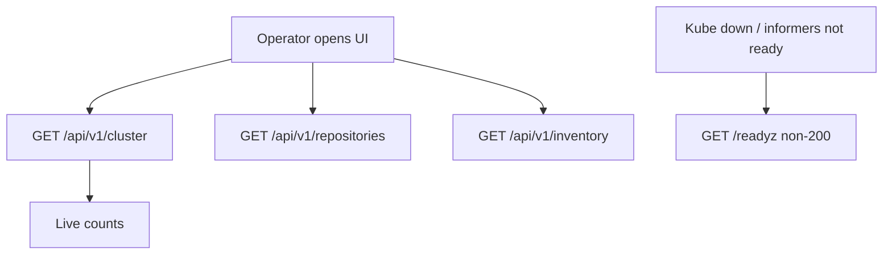

# Instruction: API — live state, CR lists, inventory, readyz

## Architecture projection

```txt
crates/proteus-api/src/
  state.rs          ✏️ extend ApiState (client + readiness + snapshot updates)
  routes.rs         ✏️ CR list routes, inventory, readyz
  inventory.rs      ✅ inventory query + DTOs (metadata only)
  resources.rs      ✅ list DTOs for Repository/Backup/Restore
  error.rs          ✏️ map kube errors / not-ready
crates/proteus-controller/src/
  main.rs           ✏️ pass Client into ApiState; wire readiness
  controllers/*.rs  ✏️ bump ClusterSnapshot counts / last_reconcile_at on reconcile
```

## User Journey



## Tasks to do

### `1)` Live ClusterSnapshot from the cluster

> Counts reflect real CR totals, not zeros forever.

1. On startup and/or each reconcile, update `repositories` / `backups` / `restores` and `last_reconcile_at`
2. Keep `GET /api/v1/cluster` returning that snapshot

### `2)` List endpoints for Proteus CRs

> `GET /api/v1/repositories|backups|restores` return JSON arrays (name, namespace, key status fields).

1. List via kube Api (cluster-scoped list is fine for MVP)
2. Stable camelCase JSON DTOs

### `3)` Inventory endpoint

> `GET /api/v1/inventory` with `namespace`, `kind`, `q` filters.

1. Kinds: Deployment, Pod, Service, PersistentVolumeClaim, ConfigMap, Secret
2. Secret rows: name/namespace/type/keys-count only — never `.data`
3. Empty namespace = all namespaces (honour RBAC)

### `4)` Honest readyz

> Liveness stays `/healthz`; readiness fails until kube is reachable and required CRDs exist (reuse controller check pattern).

1. Return non-200 when not ready
2. 200 when ready

## Test acceptance criteria

| Task | Acceptance criteria |
| ---- | ------------------- |
| 1 | After applying sample CRs, `/api/v1/cluster` counts are > 0 |
| 2 | List endpoints return those CRs with name/namespace |
| 3 | Inventory returns only allowed kinds; Secret payloads absent |
| 4 | Without kube/CRDs, `/readyz` is not 200; healthy start → 200 |
