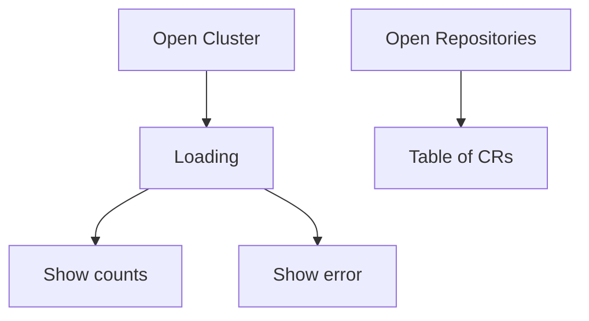

# Instruction: UI — Cluster live stats + CR list pages

## Architecture projection

```txt
crates/proteus-ui/src/
  api.rs            ✅ fetch helpers + shared types (cluster, lists)
  pages/cluster.rs  ✏️ live stats, loading/error
  pages/repositories.rs ✏️ table from API
  pages/backups.rs  ✏️ table from API (+ restores section or link)
  pages/restores.rs ✅ optional dedicated page OR fold into backups
  main.rs / shell.rs ✏️ route if Restores page added
```

## User Journey



## Wireframe

```txt
┌─ Cluster ─────────────────────────┐
│ Repositories  Backups  Restores   │
│     2            1         0      │
│ Last reconcile: 2026-07-24T…      │
│ (error banner if fetch fails)     │
└───────────────────────────────────┘

┌─ Repositories ────────────────────┐
│ NAME        NS       STATUS       │
│ local-repo  proteus  —            │
└───────────────────────────────────┘
```

## Tasks to do

### `1)` API client module

> Relative `fetch` to `/api/v1/...` with serde JSON types matching API.

1. `get_cluster`, `list_repositories`, `list_backups`, `list_restores`
2. Surface HTTP errors to UI

### `2)` Cluster page live

> Replace `—` placeholders with fetched snapshot; loading + error states.

### `3)` List pages

> Repositories / Backups / Restores populated from list APIs (poll or load-on-mount).

## Test acceptance criteria

| Task | Acceptance criteria |
| ---- | ------------------- |
| 1 | UI compiles; fetches hit relative API paths |
| 2 | Embedded UI on `:8080` shows live counts matching API |
| 3 | Sample CRs appear as rows after apply |
