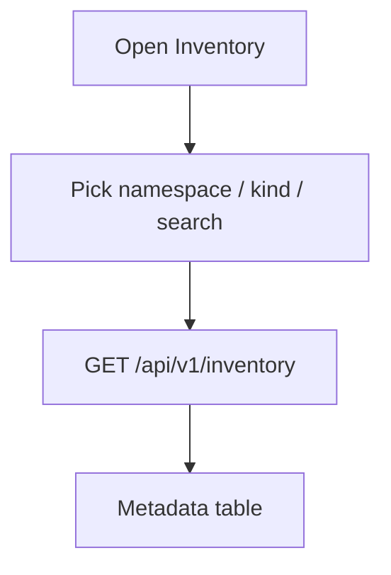

# Instruction: UI — cluster inventory with filters

## Architecture projection

```txt
crates/proteus-ui/src/
  api.rs                 ✏️ inventory types + get_inventory
  pages/inventory.rs     ✅ filters + table (or evolve pages/pvcs.rs)
  main.rs / shell.rs     ✏️ nav label Inventory (replace or keep PVCs link)
  assets/styles.css      ✏️ filter bar / table polish if needed
```

## User Journey



## Wireframe

```txt
┌─ Inventory ──────────────────────────────┐
│ Namespace [All ▾]  Kind [Pod ▾]  🔍 name │
│──────────────────────────────────────────│
│ KIND   NAME        NAMESPACE   EXTRA     │
│ Pod    web-0       demo        Running   │
│ PVC    data        demo        Bound     │
│ Secret db          demo        3 keys    │
└──────────────────────────────────────────┘
```

## Tasks to do

### `1)` Inventory page

> Filters: namespace, kind (6 kinds + All), name search; table of metadata rows.

1. Wire to inventory API
2. Secrets show no values
3. Update shell nav

### `2)` Fold #11 concern

> PVC kind in inventory satisfies PVC discovery for later M3; keep a clear PVC filter default optional.

## Test acceptance criteria

| Task | Acceptance criteria |
| ---- | ------------------- |
| 1 | Operator filters by namespace/kind/name and sees matching objects |
| 1 | Secret rows never display secret data |
| 2 | PVC objects visible via Kind=PVC |
