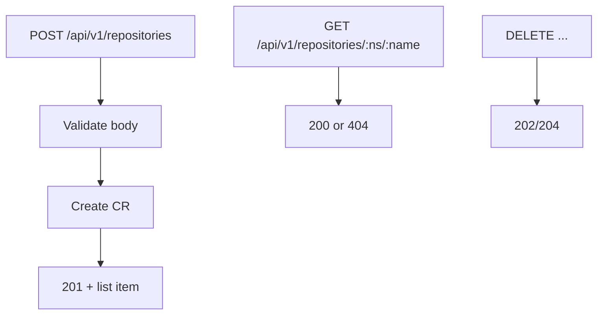

# Instruction: API CRUD for ProteusRepository

## Architecture projection

```txt
crates/proteus-api/src/
  routes.rs           ✏️ POST/GET/PATCH/DELETE repositories
  resources.rs        ✏️ create/get/update/delete + request DTOs + validation
  error.rs            ✏️ map validation / kube 409 / 404
```

## User Journey



## Tasks to do

### `1)` Request/response DTOs

> Create body: name, namespace, description?, encryptionEnabled?, backend local|s3 with fields matching CRD.

1. Reject missing path (local) or bucket/credentialsSecretRef (s3) with actionable errors
2. List item already exists — reuse / extend for get

### `2)` Routes

> `POST /api/v1/repositories`, `GET .../{namespace}/{name}`, `PATCH ...`, `DELETE ...` (keep existing list).

1. Use kube Api namespaced
2. Clear JSON error bodies on 4xx

## Test acceptance criteria

| Task | Acceptance criteria |
| ---- | ------------------- |
| 1 | Invalid local/s3 body → 4xx with message naming the field |
| 2 | POST local repo → CR exists; GET returns it; DELETE removes it |
| 2 | Existing GET list still works |
