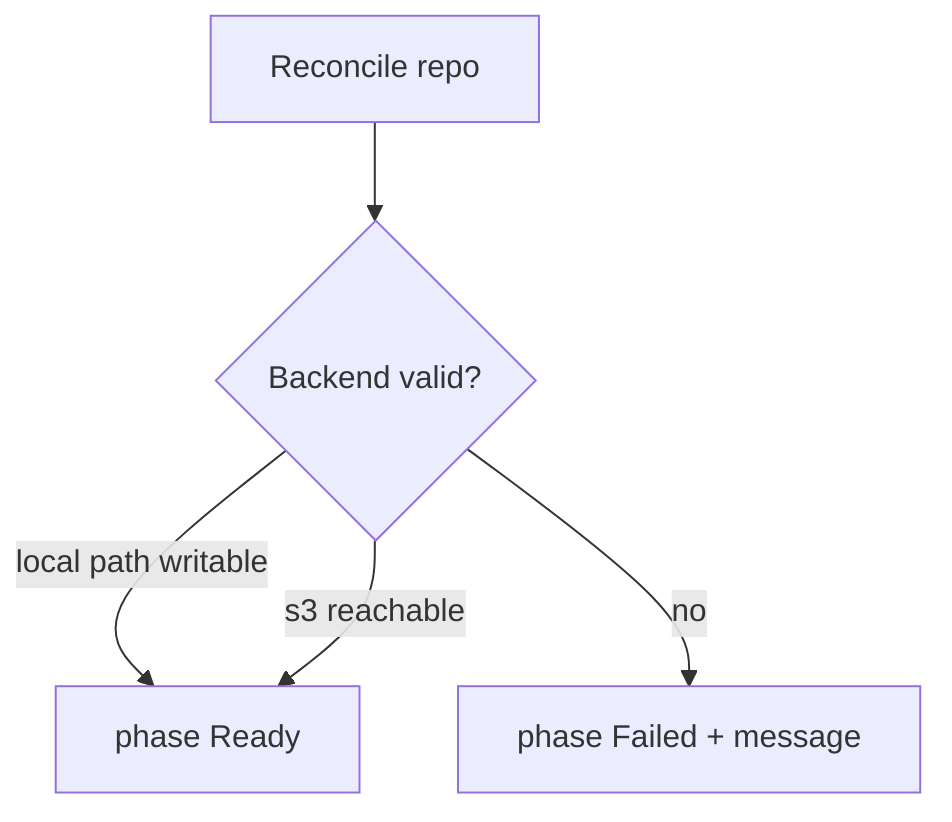

# Instruction: Controller Ready/Failed status

## Architecture projection

```txt
crates/proteus-controller/src/controllers/repository.rs  ✏️ probe + Failed phase
crates/proteus-core/src/storage/…                        ✏️ helpers used by probe if needed
```

## User Journey



## Tasks to do

### `1)` Local probe

> Ensure path exists or creatable and writable; else Failed with reason.

### `2)` S3 probe

> Best-effort: resolve Secret, build client, head-bucket or list prefix; else Failed.

### `3)` Status patch

> Set `phase`, `message`, `lastCheckedAt` on success and failure (do not only error_policy).

## Test acceptance criteria

| Task | Acceptance criteria |
| ---- | ------------------- |
| 1 | Valid local path → Ready |
| 1 | Impossible path → Failed with message |
| 2 | Missing/wrong secret → Failed |
| 3 | List/UI show phase Ready or Failed |
