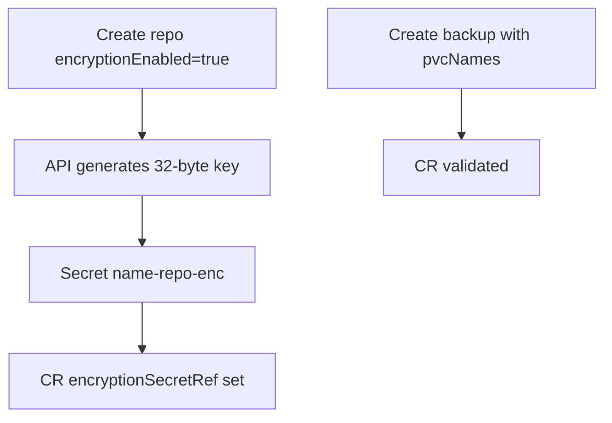

# Instruction: CRD + encryption Secret for repositories

## Architecture projection

```txt
crates/proteus-crd/src/backup.rs          ✏️ pvcNames
crates/proteus-crd/src/repository.rs      ✏️ (docs/default only if needed)
deploy/kustomize/crds/*.yaml              ✏️ regenerate via proteus-crdgen
crates/proteus-api/src/resources.rs       ✏️ encryptionEnabled → create Secret + encryptionSecretRef
deploy/README.md                          ✏️ encryption Secret key names
deploy/kustomize/base/clusterrole.yaml    ✏️ pods create/delete + pods/exec if not already
```

## User Journey



## Tasks to do

### `1)` Backup CRD: pvcNames

> Add required `pvcNames: Vec<String>` (min 1 on validate).

1. serde camelCase `pvcNames`
2. Regenerate CRD YAML

### `2)` Repo encryption Secret materialization

> When create/patch sets `encryptionEnabled: true` without existing ref, generate key Secret (`encryptionKey` raw or base64) named `<repo>-encryption`, set `encryptionSecretRef`.

1. Fail create if `encryptionEnabled` true and provided secret ref missing/invalid keys (when not generating)
2. Document Secret keys in deploy/README

## Test acceptance criteria

| Task | Acceptance criteria |
| ---- | ------------------- |
| 1 | CRD OpenAPI includes `pvcNames`; empty list rejected by API validation |
| 2 | POST repo with encryptionEnabled → Secret exists; CR has encryptionSecretRef |
