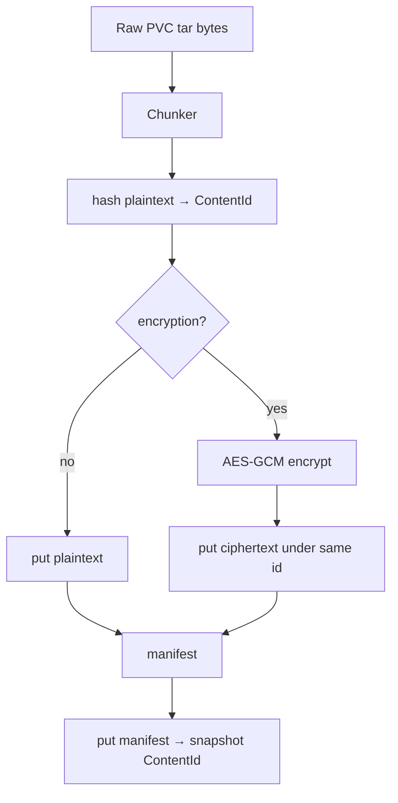

# Instruction: Core snapshot pipeline

## Architecture projection

```txt
crates/proteus-core/src/
  backup/
    mod.rs           ✅ pipeline entry
    snapshot.rs      ✅ SnapshotManifest types + serde
    pipeline.rs      ✅ ingest bytes → chunks → encrypt? → put → manifest id
  lib.rs             ✏️ re-export
```

## User Journey



## Tasks to do

### `1)` Snapshot manifest

> Versioned JSON: backup meta, per-PVC chunk id list, bytes, encrypted flag.

1. Stable serde; ContentId as hex strings

### `2)` `ingest_volume_backup` (name flexible)

> Input: `ObjectStore`, optional `EncryptionKey`, pvc name, bytes. Output: pvc section + total bytes; then `seal_snapshot` → ContentId.

1. Unit test: round-trip put/get decrypt equals plaintext when encrypted
2. Unit test: on-disk/memory blob ≠ plaintext when encrypted

## Test acceptance criteria

| Task | Acceptance criteria |
| ---- | ------------------- |
| 1 | Manifest serializes/deserializes |
| 2 | Encrypted put: store bytes are not plaintext; decrypt recovers original |
