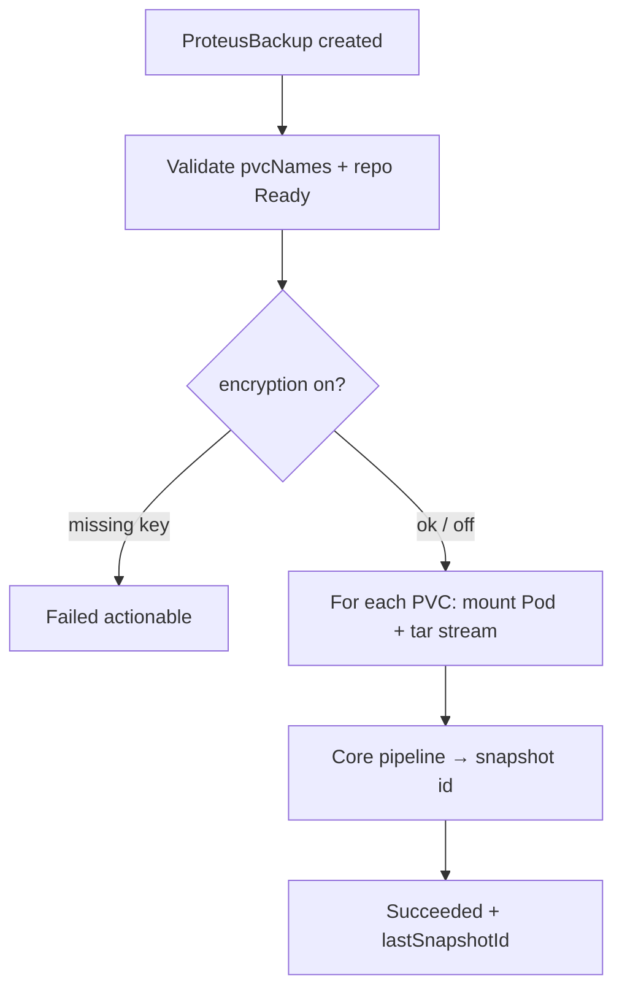

# Instruction: Controller runs backup to Succeeded/Failed

## Architecture projection

```txt
Cargo.toml (workspace kube features)      ✏️ add "ws" for exec
crates/proteus-controller/src/
  controllers/backup.rs                   ✏️ real reconcile
  backup/
    mod.rs                                ✅ helpers
    pvc_reader.rs                         ✅ mount Pod + exec tar
    repo.rs                               ✅ open Local/S3 store + load enc key
deploy/kustomize/base/clusterrole.yaml    ✏️ pods, pods/exec
```

## User Journey



## Tasks to do

### `1)` Open repository store + encryption key

> Resolve `ProteusRepository` by ref/namespace; require phase Ready; build LocalBackend/S3Backend; if encryptionEnabled load Secret → EncryptionKey or Failed.

### `2)` PVC data via mount Pod + exec

> Create short-lived Pod mounting PVC read-only at `/data`, wait Running, `tar -cf - -C /data .` via attach/exec, stream to buffer (MVP size OK), delete Pod. Enable kube `ws`. RBAC: create/get/delete pods, create pods/exec.

1. Parallel PVCs OK sequentially for MVP
2. Preserve status fingerprint discipline (no patch flood)

### `3)` Drive phases

> Pending → Running → Succeeded|Failed; set `lastSnapshotId`, `lastBytes`, timestamps; skip re-run if already Succeeded (idempotent).

## Test acceptance criteria

| Task | Acceptance criteria |
| ---- | ------------------- |
| 1 | encryptionEnabled + missing Secret → Failed with clear message |
| 2 | Valid PVC + Ready local/S3 repo → Succeeded + non-empty lastSnapshotId |
| 3 | Already Succeeded → no re-backup loop |
