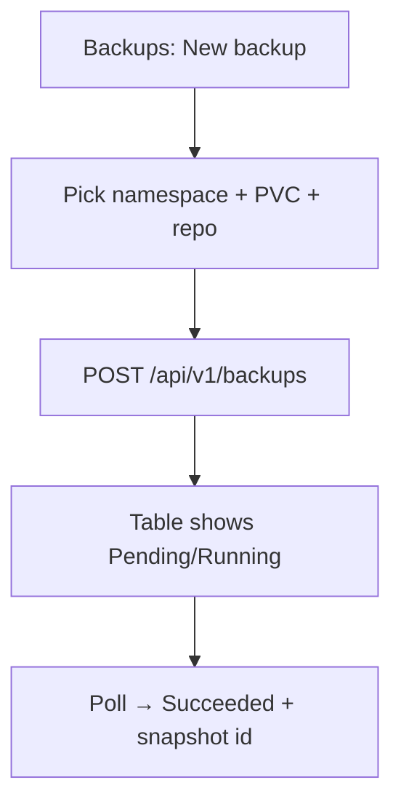

# Instruction: API create backup + UI trigger/status

## Architecture projection

```txt
crates/proteus-api/src/
  routes.rs / resources.rs     ✏️ POST/GET/DELETE backups; list item + snapshotId
crates/proteus-ui/src/
  api.rs                       ✏️ create_backup, types
  pages/backups.rs             ✏️ create form + phase poll
  pages/repositories.rs        ✏️ encryption toggle creates key Secret
```

## User Journey



## Wireframe

```txt
┌─ Backups ─────────────────────────────────────────┐
│ [+ New backup]  [Refresh]                         │
│ ┌─ form ───────────────────────────────────────┐  │
│ │ Name [........]  Namespace [▼]                │  │
│ │ Repository [▼ Ready repos]                    │  │
│ │ PVC [▼ from inventory]                        │  │
│ │                        [Create backup]        │  │
│ └───────────────────────────────────────────────┘  │
│ name | ns | repo | pvc | phase | snapshot | msg   │
└───────────────────────────────────────────────────┘
```

## Tasks to do

### `1)` API

> `POST /api/v1/backups` body: name, namespace, repositoryRef, repositoryNamespace?, targetNamespace, pvcNames[]. Validate non-empty. `GET` list includes `lastSnapshotId`. Optional DELETE.

### `2)` UI

> Form: namespace → load PVC inventory → multi or single PVC; repo dropdown (Ready only). Poll while Pending/Running. Show snapshot id + errors.

### `3)` Repo UI encryption

> Checkbox encryptionEnabled on create; no need to paste key (API generates Secret). Hint that key lives in `<name>-encryption`.

## Test acceptance criteria

| Task | Acceptance criteria |
| ---- | ------------------- |
| 1 | POST backup → CR with pvcNames; invalid body 4xx |
| 2 | UI e2e path: create → see phase progress → Succeeded |
| 3 | New encrypted repo → Secret created without kubectl |
