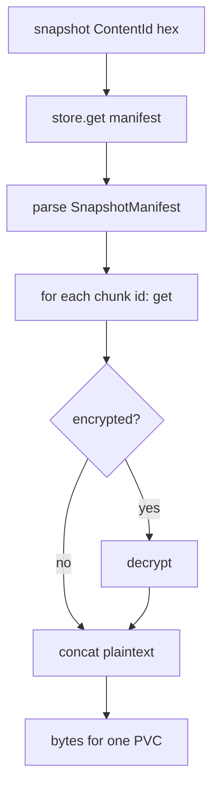

# Instruction: Core load snapshot + materialize volume

## Architecture projection

```txt
crates/proteus-core/src/backup/
  snapshot.rs     ✏️ (types already exist)
  pipeline.rs     ✏️ load_snapshot, materialize_volume
  mod.rs          ✏️ re-exports
```

## User Journey



## Tasks to do

### `1)` `load_snapshot(store, id_hex) -> SnapshotManifest`

> Fetch CAS object, JSON-parse, reject bad version.

### `2)` `materialize_volume(store, key?, volume) -> Vec<u8>`

> Get each chunk by hex ContentId; if encrypted decrypt with key (required when manifest.encrypted); concat in order; verify total bytes when possible.

1. Unit test: create_snapshot then load + materialize equals original (encrypted + plaintext)

## Test acceptance criteria

| Task | Acceptance criteria |
| ---- | ------------------- |
| 1 | Unknown id / bad JSON → clear CoreError |
| 2 | Round-trip encrypted snapshot recovers exact bytes |
