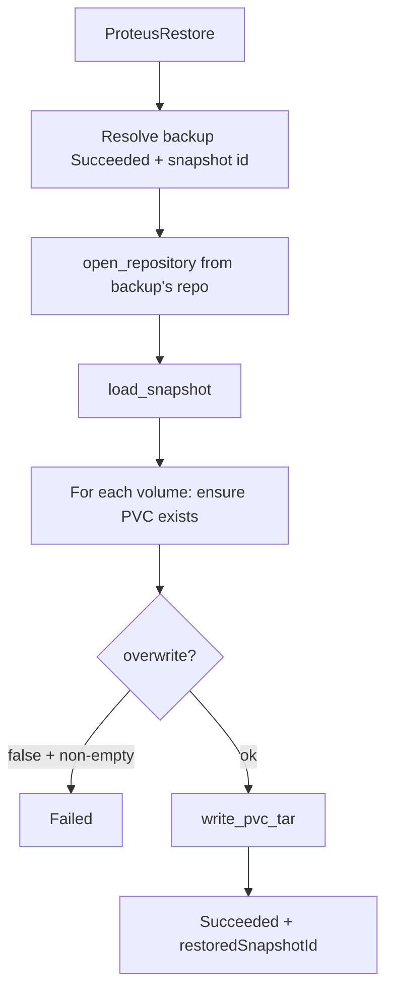

# Instruction: Controller runs restore

## Architecture projection

```txt
crates/proteus-controller/src/
  controllers/restore.rs     ✏️ real reconcile
  restore/
    mod.rs                   ✅ run_restore orchestration
    pvc_writer.rs            ✅ mount Pod RW + tar -xf
  backup/repo.rs             ♻️ open_repository
deploy/kustomize/base/clusterrole.yaml  ✏️ PVC create? no — get only OK; maybe patch not needed if PVC pre-exists
```

## User Journey



## Tasks to do

### `1)` Resolve backup + snapshot

> Load ProteusBackup by backupRef/backupNamespace (default restore ns). Require Succeeded. snapshotId = spec or lastSnapshotId.

### `2)` `write_pvc_tar` 

> Mirror `read_pvc_tar`: Pod mounts PVC RW at `/data`; if !overwrite check emptiness (`find /data -mindepth 1 | head`); if overwrite `rm -rf /data/* /data/.[!.]*` carefully or `find … -delete`; exec `tar -xf - -C /data` with stdin bytes; cleanup pod.

### `3)` Reconcile phases

> Terminal Succeeded/Failed short-circuit; status_changed before patch; Running message; actionable Failed (missing PVC, missing key, empty snapshot).

## Test acceptance criteria

| Task | Acceptance criteria |
| ---- | ------------------- |
| 1 | Backup not Succeeded / missing snapshot → Failed clear message |
| 2 | Existing empty PVC + overwrite false → Succeeded with data |
| 3 | No status patch flood on Failed |
