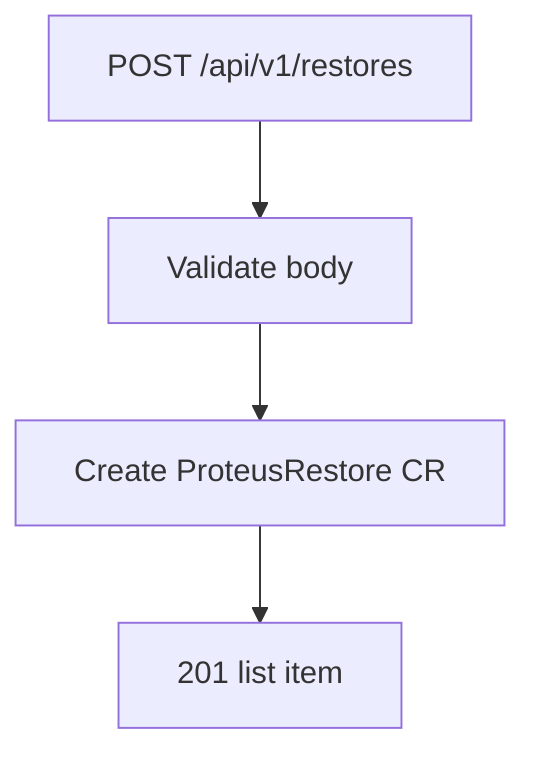

# Instruction: API create restore + RBAC

## Architecture projection

```txt
crates/proteus-api/src/
  routes.rs / resources.rs   ✏️ POST/DELETE restores; list + restoredSnapshotId
deploy/kustomize/base/clusterrole.yaml  ✏️ PVC get/list/watch enough if pre-exist; add create only if needed — skip create per plan
```

## User Journey



## Tasks to do

### `1)` DTOs + routes

> Body: name, namespace, backupRef, backupNamespace?, snapshotId?, targetNamespace, overwrite?. Validate non-empty refs. DELETE optional. List item includes restoredSnapshotId / progress if useful.

### `2)` RBAC

> Confirm pods + pods/exec already present. PVC remains get/list/watch (existence check). Document that target PVC must exist.

## Test acceptance criteria

| Task | Acceptance criteria |
| ---- | ------------------- |
| 1 | Invalid body 4xx; valid POST creates CR |
| 2 | Controller can get target PVC and exec into mount pod |
