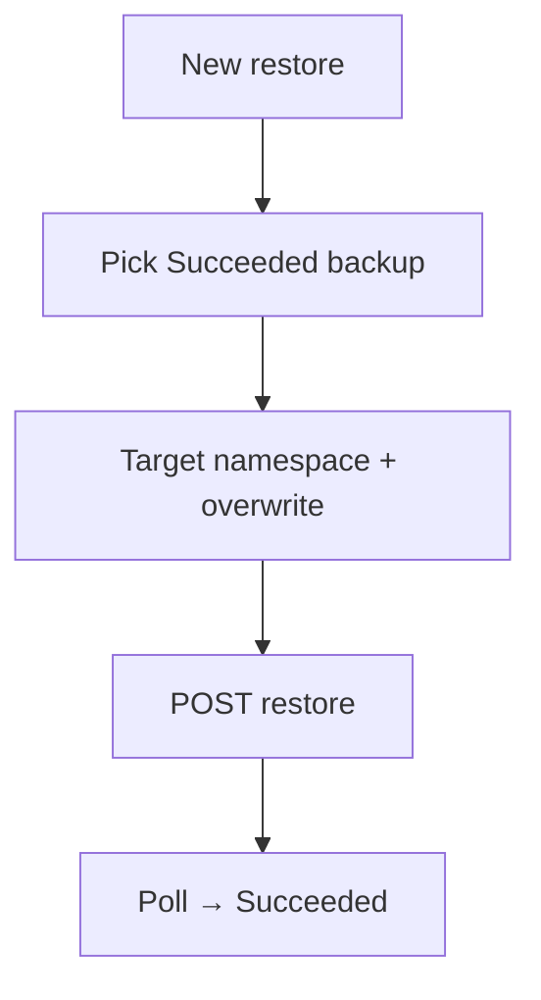

# Instruction: UI restore flow

## Architecture projection

```txt
crates/proteus-ui/src/
  api.rs                ✏️ create_restore, types
  pages/backups.rs      ✏️ New restore form + restore table polish
```

## User Journey



## Wireframe

```txt
┌─ Restores ────────────────────────────────────────┐
│ [+ New restore]                                   │
│ Backup [▼ Succeeded only]  Target NS [▼]          │
│ [ ] Overwrite existing data                       │
│                              [Create restore]     │
│ name | ns | backup | target | phase | snapshot    │
└───────────────────────────────────────────────────┘
```

## Tasks to do

### `1)` Form + API client

> Backup select shows `name (namespace)` with value `ns/name`; optional snapshot id default to backup's lastSnapshotId (can omit and let controller resolve). Target namespace select. Overwrite checkbox. Poll Pending/Running. Truncate snapshot ids like backups table.

### `2)` Delete restore (optional, nice)

> Same pattern as backup delete if cheap.

## Test acceptance criteria

| Task | Acceptance criteria |
| ---- | ------------------- |
| 1 | UI creates restore without YAML; shows Succeeded |
| 1 | Cross-namespace backupRef works via backupNamespace |
