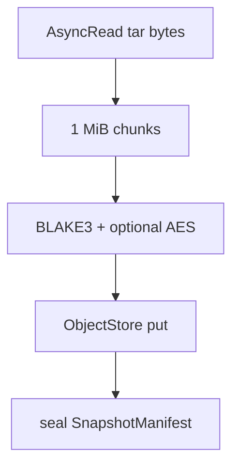

# Instruction: Streaming CAS ingest

## Architecture projection

```txt
✏️ crates/proteus-core/src/backup/pipeline.rs
✏️ crates/proteus-core/src/backup/mod.rs
```

## User Journey



## Tasks to do

### `1)` Stream ingest API

> Ingest a volume from an `AsyncRead` without holding the whole archive.

1. Add `ingest_volume_stream` / `create_snapshot_from_reader` (or multi-volume variant)
2. Unit test: stream equals buffered create_snapshot round-trip

## Test acceptance criteria

| Task | Acceptance criteria |
| ---- | ------------------- |
| 1 | Same plaintext round-trips via stream ingest as via in-memory ingest |
